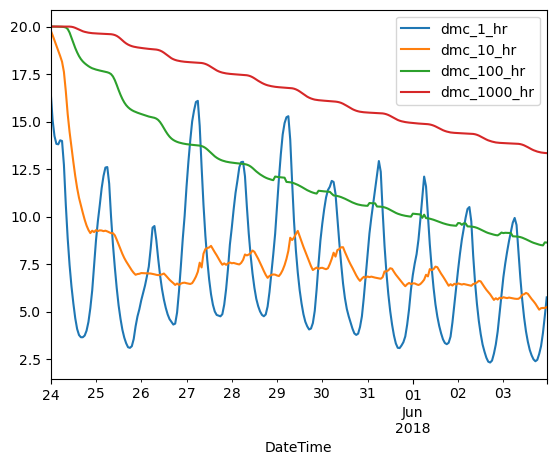

```python
import nfdrs4py
import pandas as pd
import requests
import io
```

## Run NFDRS4 Example With Config File


```python
wx = pd.read_csv('data/241513_2001_2017.fw21')
wx
```


<div>
<style scoped>
    .dataframe tbody tr th:only-of-type {
        vertical-align: middle;
    }

    .dataframe tbody tr th {
        vertical-align: top;
    }

    .dataframe thead th {
        text-align: right;
    }
</style>
<table border="1" class="dataframe">
  <thead>
    <tr style="text-align: right;">
      <th></th>
      <th>DateTime</th>
      <th>Temperature(F)</th>
      <th>RelativeHumidity(%)</th>
      <th>Precipitation(in)</th>
      <th>WindSpeed(mph)</th>
      <th>WindAzimuth(degrees)</th>
      <th>SolarRadiation(W/m2)</th>
      <th>SnowFlag</th>
      <th>GustSpeed(mph)</th>
      <th>GustAzimuth(degrees)</th>
    </tr>
  </thead>
  <tbody>
    <tr>
      <th>0</th>
      <td>2001-03-22T15:00:00-07:00</td>
      <td>62.0</td>
      <td>16.0</td>
      <td>0.0</td>
      <td>4.0</td>
      <td>6.0</td>
      <td>650.0</td>
      <td>1.0</td>
      <td>8.0</td>
      <td>34.0</td>
    </tr>
    <tr>
      <th>1</th>
      <td>2001-03-22T16:00:00-07:00</td>
      <td>58.0</td>
      <td>15.0</td>
      <td>0.0</td>
      <td>2.0</td>
      <td>69.0</td>
      <td>188.0</td>
      <td>1.0</td>
      <td>7.0</td>
      <td>60.0</td>
    </tr>
    <tr>
      <th>2</th>
      <td>2001-03-22T17:00:00-07:00</td>
      <td>60.0</td>
      <td>12.0</td>
      <td>0.0</td>
      <td>5.0</td>
      <td>270.0</td>
      <td>93.0</td>
      <td>1.0</td>
      <td>16.0</td>
      <td>243.0</td>
    </tr>
    <tr>
      <th>3</th>
      <td>2001-03-22T18:00:00-07:00</td>
      <td>58.0</td>
      <td>12.0</td>
      <td>0.0</td>
      <td>7.0</td>
      <td>278.0</td>
      <td>178.0</td>
      <td>1.0</td>
      <td>19.0</td>
      <td>258.0</td>
    </tr>
    <tr>
      <th>4</th>
      <td>2001-03-22T19:00:00-07:00</td>
      <td>57.0</td>
      <td>10.0</td>
      <td>0.0</td>
      <td>8.0</td>
      <td>300.0</td>
      <td>26.0</td>
      <td>1.0</td>
      <td>13.0</td>
      <td>289.0</td>
    </tr>
    <tr>
      <th>...</th>
      <td>...</td>
      <td>...</td>
      <td>...</td>
      <td>...</td>
      <td>...</td>
      <td>...</td>
      <td>...</td>
      <td>...</td>
      <td>...</td>
      <td>...</td>
    </tr>
    <tr>
      <th>143019</th>
      <td>2017-12-31T19:00:00-07:00</td>
      <td>18.0</td>
      <td>93.0</td>
      <td>0.0</td>
      <td>0.0</td>
      <td>196.0</td>
      <td>0.0</td>
      <td>NaN</td>
      <td>0.0</td>
      <td>186.0</td>
    </tr>
    <tr>
      <th>143020</th>
      <td>2017-12-31T20:00:00-07:00</td>
      <td>18.0</td>
      <td>93.0</td>
      <td>0.0</td>
      <td>0.0</td>
      <td>241.0</td>
      <td>0.0</td>
      <td>NaN</td>
      <td>0.0</td>
      <td>340.0</td>
    </tr>
    <tr>
      <th>143021</th>
      <td>2017-12-31T21:00:00-07:00</td>
      <td>17.0</td>
      <td>90.0</td>
      <td>0.0</td>
      <td>0.0</td>
      <td>215.0</td>
      <td>0.0</td>
      <td>NaN</td>
      <td>0.0</td>
      <td>254.0</td>
    </tr>
    <tr>
      <th>143022</th>
      <td>2017-12-31T22:00:00-07:00</td>
      <td>17.0</td>
      <td>92.0</td>
      <td>0.0</td>
      <td>0.0</td>
      <td>196.0</td>
      <td>0.0</td>
      <td>NaN</td>
      <td>0.0</td>
      <td>224.0</td>
    </tr>
    <tr>
      <th>143023</th>
      <td>2017-12-31T23:00:00-07:00</td>
      <td>17.0</td>
      <td>92.0</td>
      <td>0.0</td>
      <td>0.0</td>
      <td>220.0</td>
      <td>0.0</td>
      <td>NaN</td>
      <td>0.0</td>
      <td>206.0</td>
    </tr>
  </tbody>
</table>
<p>143024 rows × 10 columns</p>
</div>


```python
interface = nfdrs4py.NFDRS4py.init_from_config('data/NFDRSInitSample.txt')
results = interface.process_df(wx,0,1,2,3,6,4,7)
results
```


<div>
<style scoped>
    .dataframe tbody tr th:only-of-type {
        vertical-align: middle;
    }

    .dataframe tbody tr th {
        vertical-align: top;
    }

    .dataframe thead th {
        text-align: right;
    }
</style>
<table border="1" class="dataframe">
  <thead>
    <tr style="text-align: right;">
      <th></th>
      <th>DateTime</th>
      <th>Temperature(F)</th>
      <th>RelativeHumidity(%)</th>
      <th>Precipitation(in)</th>
      <th>WindSpeed(mph)</th>
      <th>WindAzimuth(degrees)</th>
      <th>SolarRadiation(W/m2)</th>
      <th>SnowFlag</th>
      <th>GustSpeed(mph)</th>
      <th>GustAzimuth(degrees)</th>
      <th>...</th>
      <th>dmc_100_hr</th>
      <th>dmc_1000_hr</th>
      <th>lmc_herb</th>
      <th>lmc_woody</th>
      <th>burning_index</th>
      <th>energy_release_component</th>
      <th>spread_component</th>
      <th>ignition_component</th>
      <th>growing_season_index</th>
      <th>kb_drought_index</th>
    </tr>
  </thead>
  <tbody>
    <tr>
      <th>0</th>
      <td>2001-03-22T15:00:00-07:00</td>
      <td>62.0</td>
      <td>16.0</td>
      <td>0.0</td>
      <td>4.0</td>
      <td>6.0</td>
      <td>650.0</td>
      <td>1.0</td>
      <td>8.0</td>
      <td>34.0</td>
      <td>...</td>
      <td>29.999996</td>
      <td>20.0</td>
      <td>30.0</td>
      <td>60.0</td>
      <td>0.0</td>
      <td>3.308081</td>
      <td>0.0</td>
      <td>0.0</td>
      <td>0.0</td>
      <td>100.0</td>
    </tr>
    <tr>
      <th>1</th>
      <td>2001-03-22T16:00:00-07:00</td>
      <td>58.0</td>
      <td>15.0</td>
      <td>0.0</td>
      <td>2.0</td>
      <td>69.0</td>
      <td>188.0</td>
      <td>1.0</td>
      <td>7.0</td>
      <td>60.0</td>
      <td>...</td>
      <td>29.999966</td>
      <td>20.0</td>
      <td>30.0</td>
      <td>60.0</td>
      <td>0.0</td>
      <td>1.858711</td>
      <td>0.0</td>
      <td>0.0</td>
      <td>0.0</td>
      <td>100.0</td>
    </tr>
    <tr>
      <th>2</th>
      <td>2001-03-22T17:00:00-07:00</td>
      <td>60.0</td>
      <td>12.0</td>
      <td>0.0</td>
      <td>5.0</td>
      <td>270.0</td>
      <td>93.0</td>
      <td>1.0</td>
      <td>16.0</td>
      <td>243.0</td>
      <td>...</td>
      <td>29.999914</td>
      <td>20.0</td>
      <td>30.0</td>
      <td>60.0</td>
      <td>0.0</td>
      <td>1.060471</td>
      <td>0.0</td>
      <td>0.0</td>
      <td>0.0</td>
      <td>100.0</td>
    </tr>
    <tr>
      <th>3</th>
      <td>2001-03-22T18:00:00-07:00</td>
      <td>58.0</td>
      <td>12.0</td>
      <td>0.0</td>
      <td>7.0</td>
      <td>278.0</td>
      <td>178.0</td>
      <td>1.0</td>
      <td>19.0</td>
      <td>258.0</td>
      <td>...</td>
      <td>29.999834</td>
      <td>20.0</td>
      <td>30.0</td>
      <td>60.0</td>
      <td>0.0</td>
      <td>0.824433</td>
      <td>0.0</td>
      <td>0.0</td>
      <td>0.0</td>
      <td>100.0</td>
    </tr>
    <tr>
      <th>4</th>
      <td>2001-03-22T19:00:00-07:00</td>
      <td>57.0</td>
      <td>10.0</td>
      <td>0.0</td>
      <td>8.0</td>
      <td>300.0</td>
      <td>26.0</td>
      <td>1.0</td>
      <td>13.0</td>
      <td>289.0</td>
      <td>...</td>
      <td>29.999721</td>
      <td>20.0</td>
      <td>30.0</td>
      <td>60.0</td>
      <td>0.0</td>
      <td>0.782769</td>
      <td>0.0</td>
      <td>0.0</td>
      <td>0.0</td>
      <td>100.0</td>
    </tr>
    <tr>
      <th>...</th>
      <td>...</td>
      <td>...</td>
      <td>...</td>
      <td>...</td>
      <td>...</td>
      <td>...</td>
      <td>...</td>
      <td>...</td>
      <td>...</td>
      <td>...</td>
      <td>...</td>
      <td>...</td>
      <td>...</td>
      <td>...</td>
      <td>...</td>
      <td>...</td>
      <td>...</td>
      <td>...</td>
      <td>...</td>
      <td>...</td>
      <td>...</td>
    </tr>
    <tr>
      <th>143019</th>
      <td>2017-12-31T19:00:00-07:00</td>
      <td>18.0</td>
      <td>93.0</td>
      <td>0.0</td>
      <td>0.0</td>
      <td>196.0</td>
      <td>0.0</td>
      <td>NaN</td>
      <td>0.0</td>
      <td>186.0</td>
      <td>...</td>
      <td>NaN</td>
      <td>NaN</td>
      <td>30.0</td>
      <td>50.0</td>
      <td>NaN</td>
      <td>NaN</td>
      <td>NaN</td>
      <td>NaN</td>
      <td>0.0</td>
      <td>100.0</td>
    </tr>
    <tr>
      <th>143020</th>
      <td>2017-12-31T20:00:00-07:00</td>
      <td>18.0</td>
      <td>93.0</td>
      <td>0.0</td>
      <td>0.0</td>
      <td>241.0</td>
      <td>0.0</td>
      <td>NaN</td>
      <td>0.0</td>
      <td>340.0</td>
      <td>...</td>
      <td>NaN</td>
      <td>NaN</td>
      <td>30.0</td>
      <td>50.0</td>
      <td>NaN</td>
      <td>NaN</td>
      <td>NaN</td>
      <td>NaN</td>
      <td>0.0</td>
      <td>100.0</td>
    </tr>
    <tr>
      <th>143021</th>
      <td>2017-12-31T21:00:00-07:00</td>
      <td>17.0</td>
      <td>90.0</td>
      <td>0.0</td>
      <td>0.0</td>
      <td>215.0</td>
      <td>0.0</td>
      <td>NaN</td>
      <td>0.0</td>
      <td>254.0</td>
      <td>...</td>
      <td>NaN</td>
      <td>NaN</td>
      <td>30.0</td>
      <td>50.0</td>
      <td>NaN</td>
      <td>NaN</td>
      <td>NaN</td>
      <td>NaN</td>
      <td>0.0</td>
      <td>100.0</td>
    </tr>
    <tr>
      <th>143022</th>
      <td>2017-12-31T22:00:00-07:00</td>
      <td>17.0</td>
      <td>92.0</td>
      <td>0.0</td>
      <td>0.0</td>
      <td>196.0</td>
      <td>0.0</td>
      <td>NaN</td>
      <td>0.0</td>
      <td>224.0</td>
      <td>...</td>
      <td>NaN</td>
      <td>NaN</td>
      <td>30.0</td>
      <td>50.0</td>
      <td>NaN</td>
      <td>NaN</td>
      <td>NaN</td>
      <td>NaN</td>
      <td>0.0</td>
      <td>100.0</td>
    </tr>
    <tr>
      <th>143023</th>
      <td>2017-12-31T23:00:00-07:00</td>
      <td>17.0</td>
      <td>92.0</td>
      <td>0.0</td>
      <td>0.0</td>
      <td>220.0</td>
      <td>0.0</td>
      <td>NaN</td>
      <td>0.0</td>
      <td>206.0</td>
      <td>...</td>
      <td>NaN</td>
      <td>NaN</td>
      <td>30.0</td>
      <td>50.0</td>
      <td>NaN</td>
      <td>NaN</td>
      <td>NaN</td>
      <td>NaN</td>
      <td>0.0</td>
      <td>100.0</td>
    </tr>
  </tbody>
</table>
<p>143024 rows × 22 columns</p>
</div>


## Run on RAWS data imported from web API


```python
station_id = '20284'
start_date = '2018-05-23T23:30:00Z'
end_date = '2018-06-03T23:29:59Z'
url = f'https://fems.fs2c.usda.gov/api/climatology/download-weather?stationIds={station_id}&startDate={start_date}&endDate={end_date}&dataset=observation&dataFormat=fw21&dataIncrement=hourly&stationtypes=RAWS(SATNFDRS)'
request = requests.get(url)
wx = pd.read_csv(io.BytesIO(request.content))
wx['SnowFlag'] = wx['SnowFlag'].astype(bool)
wx
```


<div>
<style scoped>
    .dataframe tbody tr th:only-of-type {
        vertical-align: middle;
    }

    .dataframe tbody tr th {
        vertical-align: top;
    }

    .dataframe thead th {
        text-align: right;
    }
</style>
<table border="1" class="dataframe">
  <thead>
    <tr style="text-align: right;">
      <th></th>
      <th>StationId</th>
      <th>DateTime</th>
      <th>Temperature(F)</th>
      <th>RelativeHumidity(%)</th>
      <th>Precipitation(in)</th>
      <th>WindSpeed(mph)</th>
      <th>WindAzimuth(degrees)</th>
      <th>GustSpeed(mph)</th>
      <th>GustAzimuth(degrees)</th>
      <th>SnowFlag</th>
      <th>SolarRadiation(W/m2)</th>
      <th>Tflag</th>
      <th>RHflag</th>
      <th>PCPflag</th>
      <th>WSflag</th>
      <th>WAflag</th>
      <th>SRflag</th>
      <th>GSflag</th>
      <th>GAflag</th>
    </tr>
  </thead>
  <tbody>
    <tr>
      <th>0</th>
      <td>20284</td>
      <td>2018-05-24T00:00:00-07:00</td>
      <td>34</td>
      <td>39</td>
      <td>0.0</td>
      <td>2</td>
      <td>322</td>
      <td>4</td>
      <td>217</td>
      <td>False</td>
      <td>0.0</td>
      <td>0</td>
      <td>0</td>
      <td>0</td>
      <td>0</td>
      <td>0</td>
      <td>0</td>
      <td>0</td>
      <td>0</td>
    </tr>
    <tr>
      <th>1</th>
      <td>20284</td>
      <td>2018-05-24T01:00:00-07:00</td>
      <td>32</td>
      <td>42</td>
      <td>0.0</td>
      <td>2</td>
      <td>60</td>
      <td>3</td>
      <td>52</td>
      <td>False</td>
      <td>0.0</td>
      <td>0</td>
      <td>0</td>
      <td>0</td>
      <td>0</td>
      <td>0</td>
      <td>0</td>
      <td>0</td>
      <td>0</td>
    </tr>
    <tr>
      <th>2</th>
      <td>20284</td>
      <td>2018-05-24T02:00:00-07:00</td>
      <td>29</td>
      <td>46</td>
      <td>0.0</td>
      <td>1</td>
      <td>212</td>
      <td>2</td>
      <td>50</td>
      <td>False</td>
      <td>0.0</td>
      <td>0</td>
      <td>0</td>
      <td>0</td>
      <td>0</td>
      <td>0</td>
      <td>0</td>
      <td>0</td>
      <td>0</td>
    </tr>
    <tr>
      <th>3</th>
      <td>20284</td>
      <td>2018-05-24T03:00:00-07:00</td>
      <td>28</td>
      <td>48</td>
      <td>0.0</td>
      <td>1</td>
      <td>189</td>
      <td>3</td>
      <td>12</td>
      <td>False</td>
      <td>0.0</td>
      <td>0</td>
      <td>0</td>
      <td>0</td>
      <td>0</td>
      <td>0</td>
      <td>0</td>
      <td>0</td>
      <td>0</td>
    </tr>
    <tr>
      <th>4</th>
      <td>20284</td>
      <td>2018-05-24T04:00:00-07:00</td>
      <td>26</td>
      <td>56</td>
      <td>0.0</td>
      <td>1</td>
      <td>182</td>
      <td>4</td>
      <td>223</td>
      <td>False</td>
      <td>0.0</td>
      <td>0</td>
      <td>0</td>
      <td>0</td>
      <td>0</td>
      <td>0</td>
      <td>0</td>
      <td>0</td>
      <td>0</td>
    </tr>
    <tr>
      <th>...</th>
      <td>...</td>
      <td>...</td>
      <td>...</td>
      <td>...</td>
      <td>...</td>
      <td>...</td>
      <td>...</td>
      <td>...</td>
      <td>...</td>
      <td>...</td>
      <td>...</td>
      <td>...</td>
      <td>...</td>
      <td>...</td>
      <td>...</td>
      <td>...</td>
      <td>...</td>
      <td>...</td>
      <td>...</td>
    </tr>
    <tr>
      <th>259</th>
      <td>20284</td>
      <td>2018-06-03T19:00:00-07:00</td>
      <td>79</td>
      <td>9</td>
      <td>0.0</td>
      <td>7</td>
      <td>216</td>
      <td>15</td>
      <td>270</td>
      <td>False</td>
      <td>113.0</td>
      <td>0</td>
      <td>0</td>
      <td>0</td>
      <td>0</td>
      <td>0</td>
      <td>0</td>
      <td>0</td>
      <td>0</td>
    </tr>
    <tr>
      <th>260</th>
      <td>20284</td>
      <td>2018-06-03T20:00:00-07:00</td>
      <td>68</td>
      <td>13</td>
      <td>0.0</td>
      <td>3</td>
      <td>223</td>
      <td>8</td>
      <td>216</td>
      <td>False</td>
      <td>4.0</td>
      <td>0</td>
      <td>0</td>
      <td>0</td>
      <td>0</td>
      <td>0</td>
      <td>0</td>
      <td>0</td>
      <td>0</td>
    </tr>
    <tr>
      <th>261</th>
      <td>20284</td>
      <td>2018-06-03T21:00:00-07:00</td>
      <td>59</td>
      <td>18</td>
      <td>0.0</td>
      <td>5</td>
      <td>225</td>
      <td>6</td>
      <td>232</td>
      <td>False</td>
      <td>0.0</td>
      <td>0</td>
      <td>0</td>
      <td>0</td>
      <td>0</td>
      <td>0</td>
      <td>0</td>
      <td>0</td>
      <td>0</td>
    </tr>
    <tr>
      <th>262</th>
      <td>20284</td>
      <td>2018-06-03T22:00:00-07:00</td>
      <td>52</td>
      <td>22</td>
      <td>0.0</td>
      <td>2</td>
      <td>355</td>
      <td>5</td>
      <td>224</td>
      <td>False</td>
      <td>0.0</td>
      <td>0</td>
      <td>0</td>
      <td>0</td>
      <td>0</td>
      <td>0</td>
      <td>0</td>
      <td>0</td>
      <td>0</td>
    </tr>
    <tr>
      <th>263</th>
      <td>20284</td>
      <td>2018-06-03T23:00:00-07:00</td>
      <td>47</td>
      <td>25</td>
      <td>0.0</td>
      <td>2</td>
      <td>7</td>
      <td>3</td>
      <td>52</td>
      <td>False</td>
      <td>0.0</td>
      <td>0</td>
      <td>0</td>
      <td>0</td>
      <td>0</td>
      <td>0</td>
      <td>0</td>
      <td>0</td>
      <td>0</td>
    </tr>
  </tbody>
</table>
<p>264 rows × 19 columns</p>
</div>


```python
interface = nfdrs4py.NFDRS4py(Lat=35,FuelModel='W',SlopeClass=1,AvgAnnPrecip=30)
```


```python
results = interface.process_df(wx)
results
```


<div>
<style scoped>
    .dataframe tbody tr th:only-of-type {
        vertical-align: middle;
    }

    .dataframe tbody tr th {
        vertical-align: top;
    }

    .dataframe thead th {
        text-align: right;
    }
</style>
<table border="1" class="dataframe">
  <thead>
    <tr style="text-align: right;">
      <th></th>
      <th>StationId</th>
      <th>DateTime</th>
      <th>Temperature(F)</th>
      <th>RelativeHumidity(%)</th>
      <th>Precipitation(in)</th>
      <th>WindSpeed(mph)</th>
      <th>WindAzimuth(degrees)</th>
      <th>GustSpeed(mph)</th>
      <th>GustAzimuth(degrees)</th>
      <th>SnowFlag</th>
      <th>...</th>
      <th>dmc_100_hr</th>
      <th>dmc_1000_hr</th>
      <th>lmc_herb</th>
      <th>lmc_woody</th>
      <th>burning_index</th>
      <th>energy_release_component</th>
      <th>spread_component</th>
      <th>ignition_component</th>
      <th>growing_season_index</th>
      <th>kb_drought_index</th>
    </tr>
  </thead>
  <tbody>
    <tr>
      <th>0</th>
      <td>20284</td>
      <td>2018-05-24T00:00:00-07:00</td>
      <td>34</td>
      <td>39</td>
      <td>0.0</td>
      <td>2</td>
      <td>322</td>
      <td>4</td>
      <td>217</td>
      <td>False</td>
      <td>...</td>
      <td>19.999734</td>
      <td>19.999999</td>
      <td>30.0</td>
      <td>60.0</td>
      <td>0.000000</td>
      <td>0.000000</td>
      <td>0.000000</td>
      <td>0.000000</td>
      <td>0.000000</td>
      <td>100.0</td>
    </tr>
    <tr>
      <th>1</th>
      <td>20284</td>
      <td>2018-05-24T01:00:00-07:00</td>
      <td>32</td>
      <td>42</td>
      <td>0.0</td>
      <td>2</td>
      <td>60</td>
      <td>3</td>
      <td>52</td>
      <td>False</td>
      <td>...</td>
      <td>19.998554</td>
      <td>19.999989</td>
      <td>30.0</td>
      <td>60.0</td>
      <td>0.000000</td>
      <td>0.000000</td>
      <td>0.000000</td>
      <td>0.000000</td>
      <td>0.000000</td>
      <td>100.0</td>
    </tr>
    <tr>
      <th>2</th>
      <td>20284</td>
      <td>2018-05-24T02:00:00-07:00</td>
      <td>29</td>
      <td>46</td>
      <td>0.0</td>
      <td>1</td>
      <td>212</td>
      <td>2</td>
      <td>50</td>
      <td>False</td>
      <td>...</td>
      <td>19.996832</td>
      <td>19.999972</td>
      <td>30.0</td>
      <td>60.0</td>
      <td>0.000000</td>
      <td>0.000000</td>
      <td>0.528339</td>
      <td>0.539606</td>
      <td>0.000000</td>
      <td>100.0</td>
    </tr>
    <tr>
      <th>3</th>
      <td>20284</td>
      <td>2018-05-24T03:00:00-07:00</td>
      <td>28</td>
      <td>48</td>
      <td>0.0</td>
      <td>1</td>
      <td>189</td>
      <td>3</td>
      <td>12</td>
      <td>False</td>
      <td>...</td>
      <td>19.994536</td>
      <td>19.999947</td>
      <td>30.0</td>
      <td>60.0</td>
      <td>0.000000</td>
      <td>0.000000</td>
      <td>0.821775</td>
      <td>0.747045</td>
      <td>0.000000</td>
      <td>100.0</td>
    </tr>
    <tr>
      <th>4</th>
      <td>20284</td>
      <td>2018-05-24T04:00:00-07:00</td>
      <td>26</td>
      <td>56</td>
      <td>0.0</td>
      <td>1</td>
      <td>182</td>
      <td>4</td>
      <td>223</td>
      <td>False</td>
      <td>...</td>
      <td>19.991556</td>
      <td>19.999915</td>
      <td>30.0</td>
      <td>60.0</td>
      <td>0.000000</td>
      <td>0.000000</td>
      <td>0.842248</td>
      <td>0.747889</td>
      <td>0.000000</td>
      <td>100.0</td>
    </tr>
    <tr>
      <th>...</th>
      <td>...</td>
      <td>...</td>
      <td>...</td>
      <td>...</td>
      <td>...</td>
      <td>...</td>
      <td>...</td>
      <td>...</td>
      <td>...</td>
      <td>...</td>
      <td>...</td>
      <td>...</td>
      <td>...</td>
      <td>...</td>
      <td>...</td>
      <td>...</td>
      <td>...</td>
      <td>...</td>
      <td>...</td>
      <td>...</td>
      <td>...</td>
    </tr>
    <tr>
      <th>259</th>
      <td>20284</td>
      <td>2018-06-03T19:00:00-07:00</td>
      <td>79</td>
      <td>9</td>
      <td>0.0</td>
      <td>7</td>
      <td>216</td>
      <td>15</td>
      <td>270</td>
      <td>False</td>
      <td>...</td>
      <td>8.521227</td>
      <td>13.391623</td>
      <td>30.0</td>
      <td>60.0</td>
      <td>43.918018</td>
      <td>13.209191</td>
      <td>25.687646</td>
      <td>50.040193</td>
      <td>0.074623</td>
      <td>161.0</td>
    </tr>
    <tr>
      <th>260</th>
      <td>20284</td>
      <td>2018-06-03T20:00:00-07:00</td>
      <td>68</td>
      <td>13</td>
      <td>0.0</td>
      <td>3</td>
      <td>223</td>
      <td>8</td>
      <td>216</td>
      <td>False</td>
      <td>...</td>
      <td>8.497583</td>
      <td>13.370282</td>
      <td>30.0</td>
      <td>60.0</td>
      <td>29.707420</td>
      <td>12.736459</td>
      <td>11.388582</td>
      <td>29.923758</td>
      <td>0.074623</td>
      <td>161.0</td>
    </tr>
    <tr>
      <th>261</th>
      <td>20284</td>
      <td>2018-06-03T21:00:00-07:00</td>
      <td>59</td>
      <td>18</td>
      <td>0.0</td>
      <td>5</td>
      <td>225</td>
      <td>6</td>
      <td>232</td>
      <td>False</td>
      <td>...</td>
      <td>8.481125</td>
      <td>13.355573</td>
      <td>30.0</td>
      <td>60.0</td>
      <td>34.591961</td>
      <td>12.025729</td>
      <td>16.792868</td>
      <td>31.345662</td>
      <td>0.074623</td>
      <td>161.0</td>
    </tr>
    <tr>
      <th>262</th>
      <td>20284</td>
      <td>2018-06-03T22:00:00-07:00</td>
      <td>52</td>
      <td>22</td>
      <td>0.0</td>
      <td>2</td>
      <td>355</td>
      <td>5</td>
      <td>224</td>
      <td>False</td>
      <td>...</td>
      <td>8.639911</td>
      <td>13.345286</td>
      <td>30.0</td>
      <td>60.0</td>
      <td>23.865936</td>
      <td>11.142063</td>
      <td>8.088035</td>
      <td>18.152894</td>
      <td>0.074623</td>
      <td>161.0</td>
    </tr>
    <tr>
      <th>263</th>
      <td>20284</td>
      <td>2018-06-03T23:00:00-07:00</td>
      <td>47</td>
      <td>25</td>
      <td>0.0</td>
      <td>2</td>
      <td>7</td>
      <td>3</td>
      <td>52</td>
      <td>False</td>
      <td>...</td>
      <td>8.630694</td>
      <td>13.337515</td>
      <td>30.0</td>
      <td>60.0</td>
      <td>22.471078</td>
      <td>10.204840</td>
      <td>7.747199</td>
      <td>14.670750</td>
      <td>0.074623</td>
      <td>161.0</td>
    </tr>
  </tbody>
</table>
<p>264 rows × 31 columns</p>
</div>


```python
results['DateTime'] = pd.to_datetime(results['DateTime'])
results.plot(x='DateTime',y=['dmc_1_hr','dmc_10_hr','dmc_100_hr','dmc_1000_hr'])
```


    <Axes: xlabel='DateTime'>


    

    

